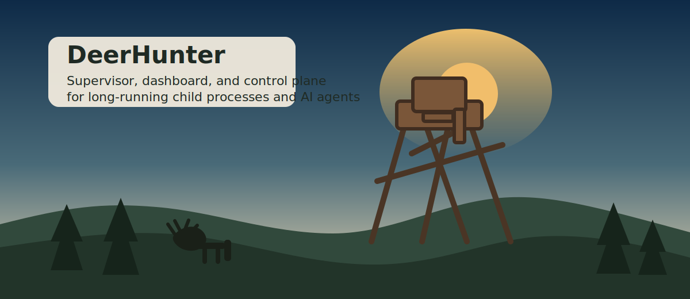

# DeerHunter



DeerHunter is a Windows-first `.NET` supervisor, dashboard, and local control plane for long-running child processes.

It is built to watch and control:

- scripts and executables
- helper processes
- background workers
- AI agent processes

## What It Does

- supervises managed child processes and helpers
- tails `stdout`, `stderr`, and optional external logs into one event pipeline
- matches signal rules and reacts with restart, kill, priority changes, helper control, and condition changes
- exposes localhost control APIs
- serves a built-in dashboard from the same local listener
- exposes DeerHunter host actions, not just child-process actions

## Dashboard

Run DeerHunter and open the configured localhost URL, typically [http://127.0.0.1:5078/](http://127.0.0.1:5078/).

The dashboard can:

- inspect DeerHunter host state
- inspect managed process and helper state
- inspect recent event history
- start, stop, restart, and reprioritize child processes
- pause supervision, resume supervision, reload configuration, and request clean shutdown of DeerHunter itself

## Quick Start

Build:

```powershell
dotnet build DeerHunter.slnx
```

Test:

```powershell
dotnet test DeerHunter.slnx
```

Run with the default config:

```powershell
dotnet run --project src/DeerHunter
```

Show help:

```powershell
dotnet run --project src/DeerHunter -- --help
```

Use a different config file:

```powershell
dotnet run --project src/DeerHunter -- --config deerhunter.json
```

## Architecture

DeerHunter deliberately stays simple:

- file-based JSON configuration
- one supervisor coordinator
- one process agent per child
- bounded in-memory event retention
- append-only JSONL event journal
- a localhost API and dashboard served by the same host

## Repository Notes

- [docs/agent-handoff.md](./docs/agent-handoff.md) is the compact handoff for future agents.
- [docs/workdiary.md](./docs/workdiary.md) records the major implementation checkpoints.
- [`.agents/tasks/`](./.agents/tasks/) contains the Ralph PRDs used to build the supervisor and the dashboard.
